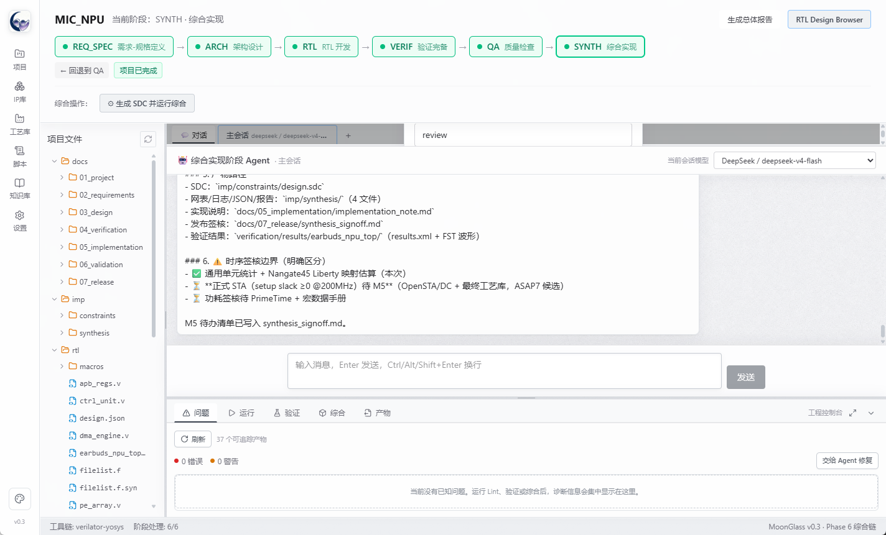
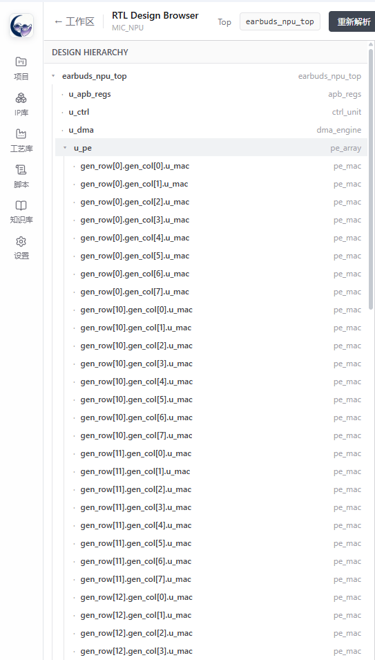
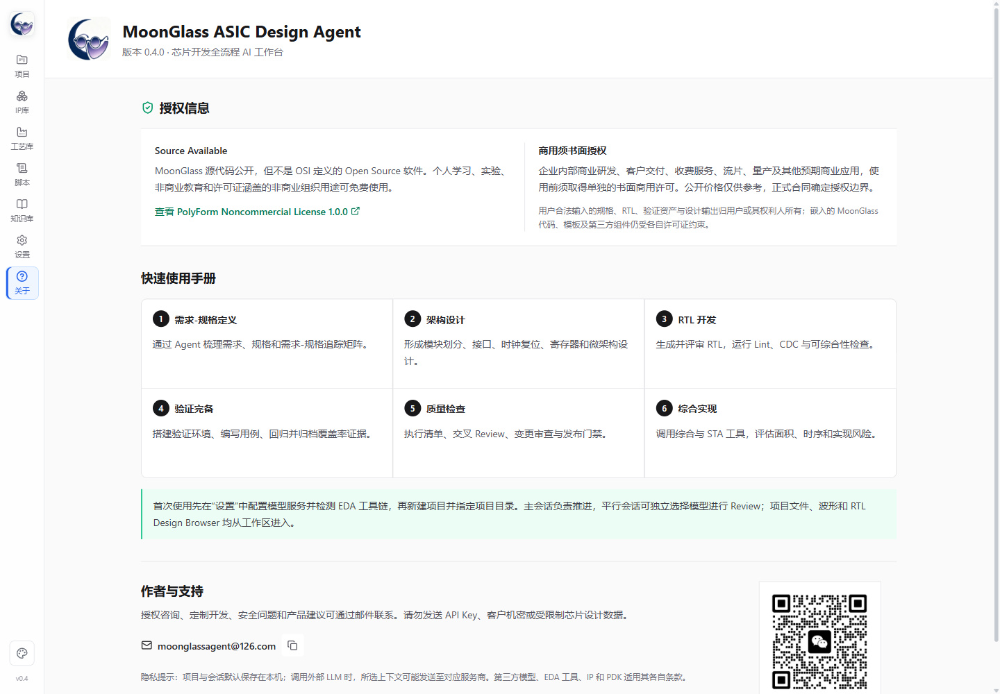

# MoonGlass ASIC Design Agent

MoonGlass 是面向 ASIC/SoC 设计工程师的 AI 工作台，以六阶段流程串联需求-规格定义、架构设计、RTL 开发、验证完备、质量检查和综合实现。

本仓库是 MoonGlass 的**首期公开源码仓库**，公开 Renderer UI、六阶段流程框架、公共领域类型和 IPC 契约，供产品体验、流程研究和社区协作。完整 Agent 编排、EDA 自动化和工程执行能力暂未全部公开。

> 可直接运行的 Windows 完整绿色版请从 GitHub Releases 下载。绿色版包含 MIC_NPU Demo，但不包含模型 API Key。

## 新手入口

- [在线网页版说明书](https://moonglassagent.github.io/MoonGlass/)：适合直接打开和分享，支持标题、摘要和封面卡片。
- [傻瓜式 HTML 使用说明书](./docs/QUICK-START-ZH-CN.html)：从解压启动、配置模型到完成六阶段开发，适合第一次使用 MoonGlass 的用户。
- [中文实用手册](./docs/USER-MANUAL-ZH-CN.md)：简明功能说明与工程注意事项。
- [下载 MoonGlass v0.6.0 完整绿色版](https://github.com/MoonGlassAgent/MoonGlass/releases/tag/v0.6.0)

## 能做什么

- 芯片设计工程师可快速完成 RTL 开发、代码检查、验证执行与回归闭环。
- 架构师可根据需求和规格快速形成设计 Demo，并进入综合评估面积与时序。
- 验证工程师可基于规格、架构和需求-规格矩阵搭建验证环境、生成用例并整理质量证据。
- 主会话可完成 Cocotb + Icarus 功能回归、Verilator RTL 覆盖率签核，并通过独立证据 Review 核验测试、JUnit、日志和覆盖率。
- 主会话与平行会话可独立选择模型，用不同模型交叉 Review。
- 前序阶段发生变更时，对已完成的后续阶段产生变更响应提醒。
- 可选择后续若干阶段一键托管，自动处理推荐项、质量门禁和修复重试，结束后形成托管报告。
- 导入已有工程时自动分析目录、文档、RTL、验证与综合证据，恢复到实际开发阶段，而非一律按新项目处理。

## 六阶段流程

```text
REQ_SPEC 需求-规格定义
    -> ARCH 架构设计
    -> RTL RTL 开发
    -> VERIF 验证完备
    -> QA 质量检查
    -> SYNTH 综合实现
```

需求和规格在同一阶段协同形成，但仍通过需求-规格矩阵保持需求、设计项、验证点和质量证据的双向追踪。

## 软件界面

### 六阶段项目工作区

项目工作区集中展示阶段推进、项目文件、主会话与平行会话、Agent 执行过程以及质量问题。阶段变更会沿已完成的后续阶段传播提醒。



### RTL Design Browser

RTL Design Browser 用于解析 Top、展开设计层次并查看模块实例关系，辅助架构 Review、RTL 定位和综合前检查。



### 授权与快速使用说明

软件内置中文授权摘要、六阶段快速手册、隐私提示以及商务授权联系方式。



## 本次公开范围

公开内容：

- `src/renderer/`：React UI、项目面板、阶段看板、会话界面、文件树、设置和关于页面
- `src/shared/`：公共领域类型、阶段数据结构、IPC 契约和 Provider 预设
- `docs/USER-MANUAL-ZH-CN.md`：中文实用手册
- `docs/QUICK-START-ZH-CN.html`：可离线打开和打印的中文新手说明书
- 授权、隐私、安全与贡献说明

暂未公开：

- Electron 主进程和持久化服务实现
- Agent 调度、会话恢复、系统 Prompt 与 Skills
- EDA Bridge、自动验证与 Bugfix 循环
- RTL Engine 与 RTL Design Browser 核心引擎
- MIC_NPU Demo 源工程及内部测试资产

因此，本仓库当前用于查看和协作公开框架，**不能单独构建出 GitHub Release 中的完整绿色版**。详见 [PUBLIC-SOURCE-SCOPE.md](./PUBLIC-SOURCE-SCOPE.md)。

## 版本

当前版本：`v0.6.0`

v0.6.0 重点增强主会话端到端验证能力，加入功能覆盖率、RTL 覆盖率、双通道结果合并、独立证据 Review 和验证签核门禁；同时增强总体报告、项目信息编辑、模型恢复显示和文件查找。完整功能请使用 Release 中的 Windows 绿色版。

第一次使用建议先看 [傻瓜式 HTML 使用说明书](./docs/QUICK-START-ZH-CN.html)，工程说明见 [中文实用手册](./docs/USER-MANUAL-ZH-CN.md)。

## 授权

MoonGlass 是 **Source Available** 软件，不是 OSI 定义的 Open Source 软件。

- 非商业用途遵循 [PolyForm Noncommercial License 1.0.0](./LICENSE)。
- 企业研发、客户交付、收费服务、流片、量产及其他商业用途须事先取得单独书面授权。
- 商用方案和参考价格见 [COMMERCIAL-LICENSE.md](./COMMERCIAL-LICENSE.md)。
- 历史授权边界见 [LICENSE-CHANGE.md](./LICENSE-CHANGE.md)。

用户合法输入的需求、规格、RTL、验证资产和设计输出归用户或其权利人所有。嵌入输出的 MoonGlass 代码、模板及第三方组件仍受各自许可证约束。

## 联系

商务授权、定制开发、安全问题和产品建议：`moonglassagent@126.com`
