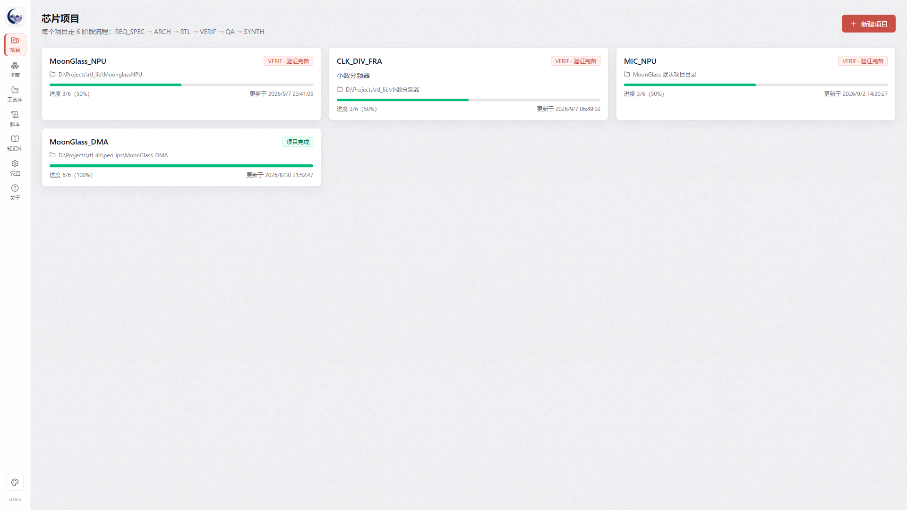
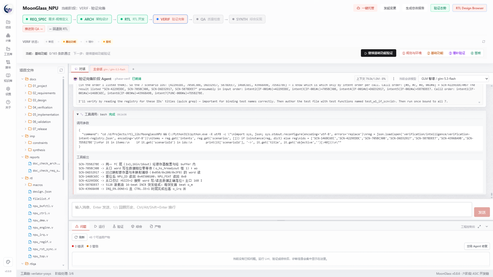
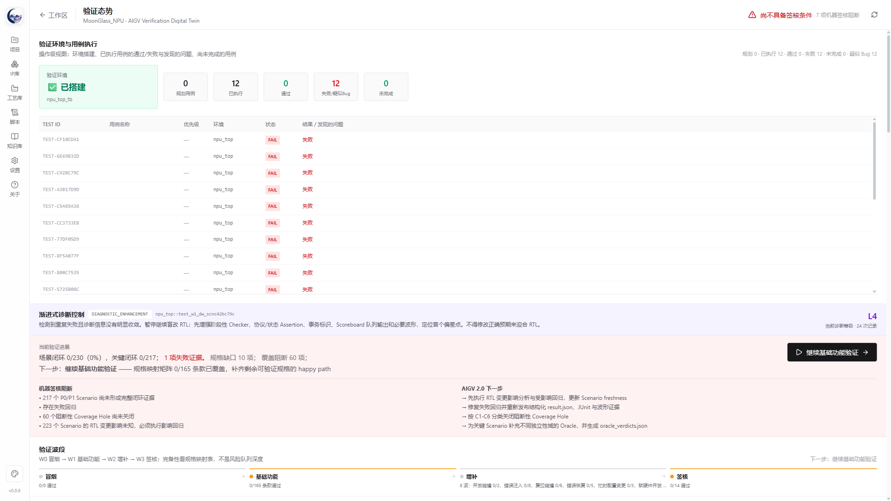
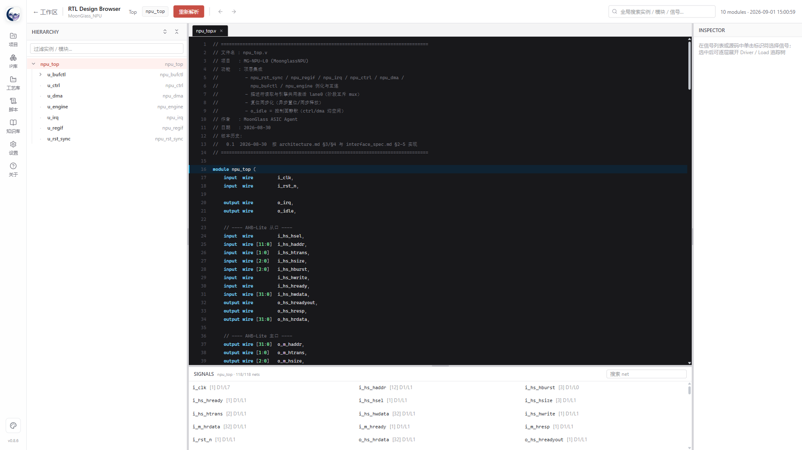

# MoonGlass ASIC Design Agent

MoonGlass 是面向 ASIC/SoC 工程师的芯片开发全流程 AI 工作台。它把需求、规格、架构、RTL、验证、质量和综合组织成一条可追踪、可审查、可恢复的工程链，让 Agent 的工作结果不仅是“生成了一段代码”，而是能够逐步形成设计文件、验证证据、问题记录和交付报告。

当前版本：**v0.9.0** ｜ Windows x64

[下载绿色版](https://github.com/MoonGlassAgent/MoonGlass/releases/tag/v0.9.0) · [在线使用手册](https://moonglassagent.github.io/MoonGlass/) · [AIGV 方法学说明](./docs/MOONGLASS-AIGV-2.0-WHITEPAPER.html) · [问题与讨论](https://github.com/MoonGlassAgent/MoonGlass/issues)

## MoonGlass 能做什么

芯片码农可以用它从需求和架构快速推进到 RTL、Lint、CDC、仿真和回归；架构师可以在规格约束下生成设计 Demo，并调用综合工具评估面积、时序与实现风险；验证工程师可以围绕 Verification Intent、Scenario、Checker、Golden Model、Coverage 和多重 Oracle 建立可追踪的验证闭环。

MoonGlass 的核心目标是把 Agent 放进真实工程流程中：每个阶段都有上下文、文件、操作、门禁和证据，用户可以查看过程、干预决策、切换模型、恢复会话，也可以让主会话执行端到端推进，让平行会话独立完成 Review 或补充分析。

## 六阶段工程流程

```text
REQ_SPEC 需求-规格定义
    ↓
ARCH     架构设计
    ↓
RTL      RTL 开发
    ↓
VERIF    验证完备
    ↓
QA       质量检查
    ↓
SYNTH    综合实现
```

阶段不是简单的页面切换。用户可以回到任意阶段修改内容，MoonGlass 会保留后续结果，同时对已经完成但受到影响的阶段标记变更提醒；后续阶段可以重新执行，或由用户逐项响应变更。

## 验证方法学：AIGV 2.0

MoonGlass 的验证重点不是只运行几个测试，而是建立“规格语义 → 验证意图 → 场景 → 激励 → Checker/Oracle → 证据 → 风险结论”的闭环。

- **Verification Intent**：把规格中的行为目标转成可检查的语义目标。
- **Scenario Registry**：记录正常、异常、边界、时序、并发和复位场景。
- **Checker / Golden Model / Oracle**：根据模块角色和验证层级选择，不强制所有模块使用同一种验证方式。
- **Coverage Hole**：说明具体缺失场景、缺失激励和下一步建议，而不是只显示一个抽象分类。
- **Residual Risk**：记录尚未闭环的风险、工具限制、证据不足和签核阻断原因。
- **W0-W3 验证波段**：从环境与基础功能，到增补验证、签核和残余风险审查。
- **验证态势**：集中展示 Spec Gap、Intent 闭环率、风险热区、覆盖缺口、失败诊断和下一步行动。

详细说明：[MoonGlass AIGV 2.0 白皮书](./docs/MOONGLASS-AIGV-2.0-WHITEPAPER.html) ｜ [AIGV 方法学论文](./docs/MOONGLASS-AIGV-METHODOLOGY-ZH-CN.html)

## 主要能力

| 能力 | 说明 |
|---|---|
| 项目与阶段管理 | 新建、导入、迁移项目；识别既有项目阶段；阶段回退、变更传播和阶段输出清理 |
| 主会话与平行会话 | 独立选择模型；会话恢复、无上下文重启、上下文统计和批次隔离 |
| 一键托管 | 选择后续流程，Agent 按完成屏障等待任务、处理门禁并生成托管报告 |
| RTL 工程 | 文件树、行号、语法高亮、搜索、只读查看、RTL 模板和项目文件管理 |
| EDA 工具链 | Verible、Yosys、Verilator、Icarus Verilog、Cocotb、Slang、SymbiYosys、Boolector、Bitwuzla 等 |
| 验证闭环 | 回归、覆盖率、Formal 尝试、Checker、Golden Model、诊断增强和证据化签核 |
| RTL Design Browser | 层次树、源码、信号列表、Driver/Load 追踪和跨层次定位 |
| IP 模板库 | 用户导入 IP 路径，自动识别、索引并在架构、RTL 和验证阶段提供复用建议 |
| 多模型服务 | OpenAI 兼容接口及多个 Provider；连接测试、模型切换、失败恢复和状态保持 |
| 主题与交付 | 浅色、深色、跟随系统；Windows 安装包和包含 MIC_NPU Demo 的绿色版 |

## 界面预览









## 快速开始

普通用户建议直接下载 [Windows x64 绿色版](https://github.com/MoonGlassAgent/MoonGlass/releases/tag/v0.9.0)，解压后运行 `MoonGlass.exe`。首次使用：

1. 在“设置”中配置模型 Provider、API Key、Base URL 和模型列表。
2. 在“设置”中检查开发环境与 EDA 工具链状态。
3. 新建项目或导入已有项目，并指定项目目录。
4. 从需求-规格定义阶段开始推进，或进入识别出的既有阶段。
5. 在每个阶段检查 Agent 输出、文件变化、工具结果和门禁，再决定是否推进。

完整说明：[MoonGlass 用户手册](./docs/USER-MANUAL-ZH-CN.md) ｜ [HTML 快速手册](./docs/QUICK-START-ZH-CN.html)

## 从源码运行

要求：Node.js ≥ 22，pnpm ≥ 10。Python 3.10+ 和 EDA 工具可由设置页检测，也可以使用系统中已有安装。

```bash
pnpm install
pnpm dev
pnpm typecheck
pnpm test
pnpm build
pnpm dist
```

绿色版构建入口：[`Build-Green.ps1`](./Build-Green.ps1)。它会执行检查、构建、打包、敏感信息扫描并输出 SHA-256 校验文件。

## 工程思想

MoonGlass 遵循几个基本原则：

1. **证据优先**：Agent 的结论必须尽可能回到文件、日志、波形、覆盖率和工具原始输出。
2. **阶段可追踪**：需求、规格、架构、RTL、测试和签核材料保持双向追溯。
3. **增量可验证**：复杂项目按顶层和子模块角色分层验证，避免无意义地对所有模块执行同样重量的流程。
4. **失败要可解释**：区分 RTL 缺陷、测试环境问题、工具限制、模型服务失败和证据缺失。
5. **长任务要可治理**：会话、批次、上下文、看门狗、完成屏障和变更响应共同约束 Agent 的长时间运行。
6. **人机边界清晰**：Agent 可以执行工程动作，但用户始终能够查看、干预、复核和决定签核。

## 学术与社区交流

MoonGlass 同时作为一个工程实验平台，持续整理 ASIC Agent、证据驱动开发、AIGV、长时 Agent 上下文治理和人机协同签核方面的实践材料。相关文档用于工程讨论、方法学比较和后续实验设计，不代表同行评审结论，也不替代商业 EDA 签核认证。

- [从证据驱动流程到任务级验证协同：MoonGlass v0.6.0-v0.9.0 工程演进](./docs/MOONGLASS-v0.6.0-TO-v0.9.0-EVOLUTION-ZH-CN.html)
- [证据驱动型 ASIC Agent 工作流](./docs/EVIDENCE-DRIVEN-ASIC-AGENT-WORKFLOW-ZH-CN.html)
- [MoonGlass AIGV 方法学](./docs/MOONGLASS-AIGV-METHODOLOGY-ZH-CN.html)
- [MoonGlass AIGV 2.0 白皮书](./docs/MOONGLASS-AIGV-2.0-WHITEPAPER.html)
- [长时 Agent 芯片开发工程学](./docs/MOONGLASS-LONG-RUN-AGENT-ENGINEERING-ZH-CN.html)
- [总体工程报告](./reports/overall-report.md)

欢迎通过 GitHub Issues 讨论复现问题、验证策略、工具链适配、AIGV 语义和工程改进建议。

## 开源声明与授权

MoonGlass 当前是 **Source Available** 软件，源码公开可阅读和讨论，但**不是 OSI 定义的 Open Source 软件**。公开仓库不等于无条件授权，使用、修改、分发和商业化都应遵守仓库中的许可证和授权条款。

- 非商业用途：个人学习、学术研究、实验和非商业教育用途，遵循 [PolyForm Noncommercial License 1.0.0](./LICENSE)。
- 商业用途：企业内部商业研发、客户交付、收费服务、流片、量产以及其他预期商业应用，必须在使用前取得单独的书面商业授权。
- 商业授权条款与参考方案：[`COMMERCIAL-LICENSE.md`](./COMMERCIAL-LICENSE.md)。
- 历史授权边界和变更记录：[`LICENSE-CHANGE.md`](./LICENSE-CHANGE.md)。
- 第三方组件、EDA 工具和运行时许可证：[`THIRD-PARTY-NOTICES.md`](./THIRD-PARTY-NOTICES.md)。

用户输入的需求、规格、RTL、验证资产和设计输出归用户或其权利人所有。MoonGlass 自身代码、模板、内置工具链和第三方组件仍分别受对应许可证约束。

## 作者与维护者

MoonGlass ASIC Design Agent 由 **MoonGlassAgent** 发起和维护，面向 ASIC/SoC 设计、验证自动化和 AI 辅助工程流程持续开发。

- GitHub：[@MoonGlassAgent](https://github.com/MoonGlassAgent)
- 项目仓库：[MoonGlass](https://github.com/MoonGlassAgent/MoonGlass)
- 联系邮箱：`moonglassagent@126.com`

## 商业合作与技术支持

欢迎围绕以下方向开展合作：

- 企业内部 ASIC/SoC 开发流程落地
- MoonGlass 私有化部署和团队协同
- EDA 工具链、仿真器、综合工具和工艺库适配
- AIGV 验证方法学定制与验证流程建设
- IP/RTL 项目导入、迁移和自动化改造
- 定制 Agent、模型服务和企业规则接入
- 芯片项目技术培训、PoC 和工程咨询

商业授权、定制开发、技术支持和合作咨询请联系：`moonglassagent@126.com`。

安全问题请通过邮件单独联系，邮件中不要发送 API Key、客户机密、受限制的芯片设计数据或未公开的工艺资料。
